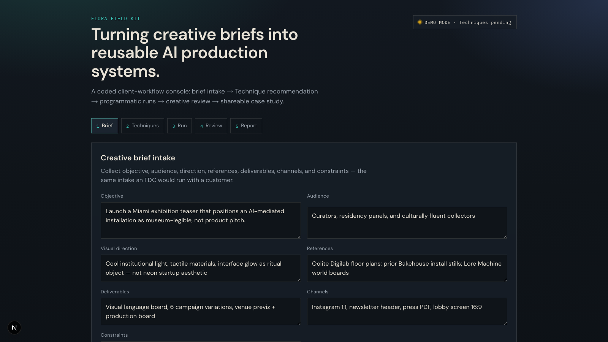
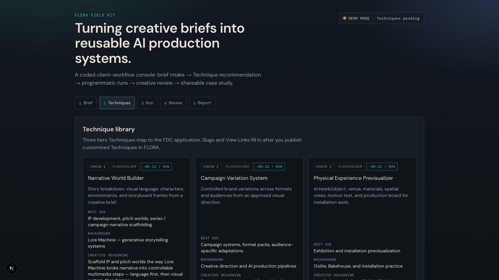
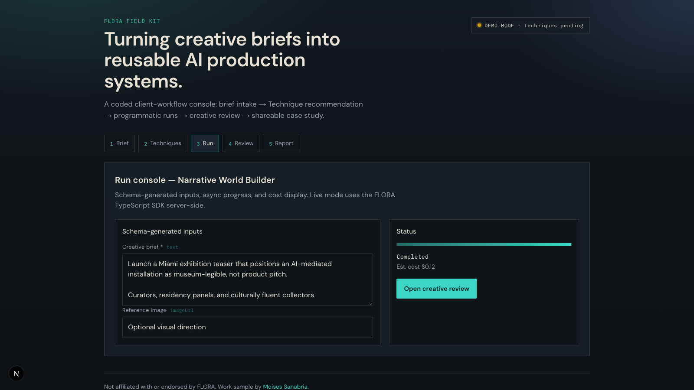
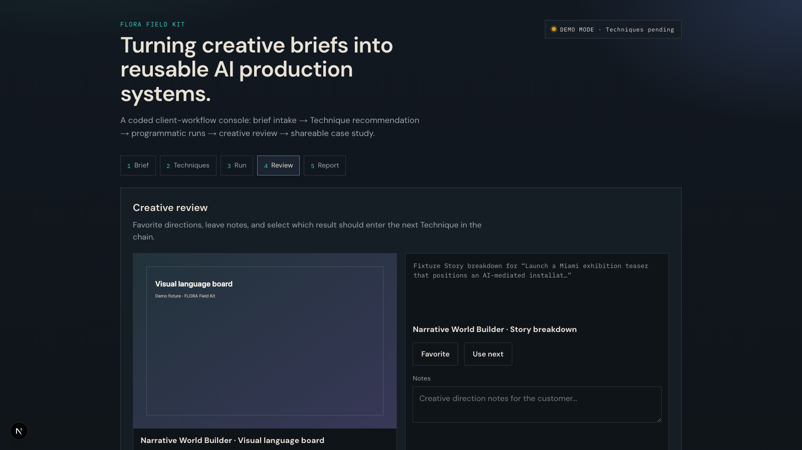
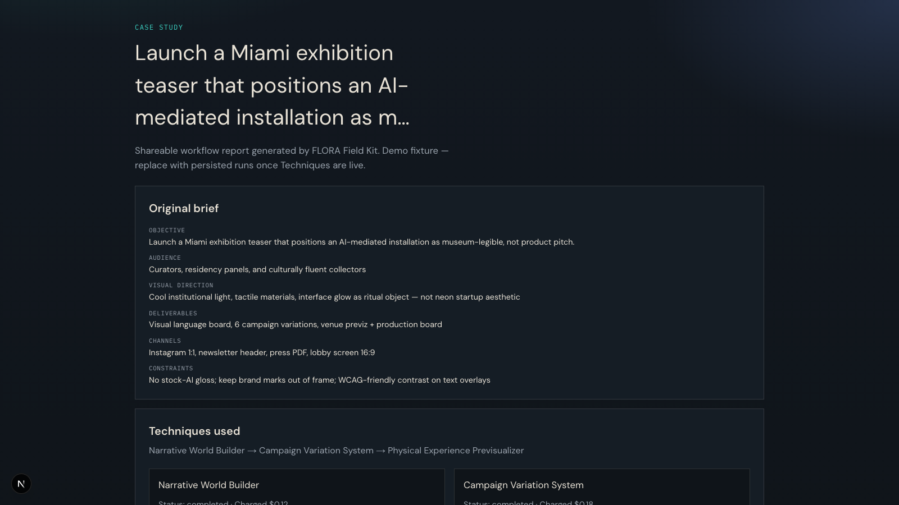

# FLORA Field Kit

**A coded client-workflow console that turns a creative brief into a reusable FLORA production system.**

> Turning creative briefs into reusable AI production systems.

| | |
|---|---|
| **Live demo** | [flora-field-kit.moises.tech](https://flora-field-kit.moises.tech) |
| **Demo case study** | [/case/demo-miami-exhibition-teaser](https://flora-field-kit.moises.tech/case/demo-miami-exhibition-teaser) |
| **Source** | [github.com/moisestech/flora-field-kit](https://github.com/moisestech/flora-field-kit) |

This is an independent **Forward Deployed Creative** work sample — not a portfolio site and **not affiliated with or endorsed by FLORA**.


## What this proves (10 seconds)

Recruiters and hiring managers should open the **live demo** (no API key) and walk:

1. **Brief** — intake objective, audience, direction, constraints  
2. **Techniques** — three hero workflows with clone bases and costs  
3. **Run** — schema-generated inputs + async progress  
4. **Review** — favorite, notes, select what enters the next Technique  
5. **Report** — shareable case-study URL  

That loop is the miniature FDC job: understand a customer brief, adapt Techniques, run them programmatically, refine with the team, leave a reusable system.

### Console walkthrough (demo mode)

| Step | Screenshot |
|------|------------|
| **1 · Brief** |  |
| **2 · Techniques** |  |
| **3 · Run** |  |
| **4 · Review** |  |
| **5 · Case study** |  |

## Open the demo (no API key)

```bash
npm install
npm run dev
# → http://localhost:3000
```

Or use production: [flora-field-kit.moises.tech](https://flora-field-kit.moises.tech)

Demo mode is the default when `FLORA_API_KEY` is missing.


## Architecture (short)


| Layer | Role |
|-------|------|
| Browser | Field Kit console UI only |
| `app/api/flora/*` | Server routes — mode, techniques, runs, status |
| `@flora-ai/flora` | Server-only SDK (`FLORA_API_KEY` never shipped to the client) |
| FLORA cloud | Executes published Techniques by slug |
| Technique Builder | Authors workflows inside FLORA — Field Kit does not build canvases |

Details: [`docs/architecture.md`](docs/architecture.md)

## Three hero Techniques


| Technique | Clone bases (customize these) | Status |
|-----------|-------------------------------|--------|
| **Narrative World Builder** | dreamscape · character-lock · video-scene-builder | Placeholder — awaiting View Link |
| **Campaign Variation System** | illustration-branding-design · material-3d-logo-render-engine | Placeholder — awaiting View Link |
| **Physical Experience Previsualizer** | wireframe · material-3d-logo-render-engine | Placeholder — awaiting View Link |

Ranking and wiring checklist: [`docs/techniques.md`](docs/techniques.md)

## Live mode (optional)

1. Create an API key in FLORA → Settings → API Keys (paid subscription).  
2. Copy [`.env.example`](.env.example) → `.env.local` and set `FLORA_API_KEY` (**never** commit or paste in chat).  
3. Publish the three Techniques; set `slug` + `viewLink` in [`lib/techniques.ts`](lib/techniques.ts).  
4. `npm run dev` — mode pill shows **LIVE**.  

Force fixtures even with a key: `DEMO_MODE=1`.

## Application package

Fourth artifact for **FLORA Forward Deployed Creative** (alongside three Technique View Links):

| Artifact | Where |
|----------|--------|
| Field Kit console | this repo + [live demo](https://flora-field-kit.moises.tech) |
| Private dossier | moises.tech `/opportunities/flora-forward-deployed-creative` |
| Technique View Links | pending Technique Builder publish |

Mapping: [`docs/application.md`](docs/application.md)

## Docs

| Doc | Purpose |
|-----|---------|
| [`docs/architecture.md`](docs/architecture.md) | Modes, authorship vs API, case study |
| [`docs/application.md`](docs/application.md) | FDC fit + status gates |
| [`docs/techniques.md`](docs/techniques.md) | Clone intake, ranking, slug wiring |
| [`docs/media.md`](docs/media.md) | **Images & diagrams inventory** for README / hiring packet |

## Media status

S1–S5 screenshots and diagrams D1–D4 are embedded above. Full inventory: [`docs/media.md`](docs/media.md).

| Priority | Asset | Status |
|----------|-------|--------|
| 1 | Real Technique View Link stills T1–T3 | After publish in FLORA |
| 2 | Optional sequence diagram D5 | Nice-to-have |
| 3 | 60–90s demo recording | Optional recruiter walkthrough |

Re-capture screenshots anytime:

```bash
npm run capture:screenshots
# requires: npm run dev (default http://localhost:3000)
```

## Stack

- Next.js + TypeScript  
- `@flora-ai/flora` (server-only)  
- Schema-driven Technique forms  
- Async run console + demo fixtures  
- Interactive review (favorites / notes / chain select)  
- Shareable case-study routes  

## License

MIT — see [LICENSE](LICENSE).
