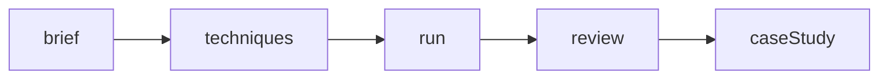

# FDE lane — creative delivery overlay

This repo is the **Forward Deployed Creative** work sample: brief → techniques → run → review → shareable case. It is not an agent runtime and not affiliated with FLORA.

Sister repos: [agentic-ops](https://github.com/moisestech/agentic-ops) · [agentic-evidence-pipeline](https://github.com/moisestech/agentic-evidence-pipeline) · [comfyui-output-provenance](https://github.com/moisestech/comfyui-output-provenance). Spine: [agentic-ops/docs/FDE-ROADMAP.md](https://github.com/moisestech/agentic-ops/blob/main/docs/FDE-ROADMAP.md).

Application checklist stays in [`application.md`](application.md). This file only maps that work onto the FDE skill stack.

## Skill map

| FDE skill | Status in Field Kit | Notes |
| --- | --- | --- |
| Customer discovery / brief | **done (demo)** | Intake form + Miami exhibition case |
| Scoping / technique choice | **partial** | Library exists; hero View Links still placeholders |
| Execute in the customer tool | **demo fixtures** | Live `@flora-ai/flora` waits on paid plan + published slugs |
| HITL review | **done (demo)** | Favorites, notes, chain select |
| Handover / case study | **done (demo)** | Shareable `/case/...` URL |
| Cost control | **honest gap** | Unverified run costs were removed; do not invent numbers |
| MCP | **authoring only** | Cursor + FLORA MCP is not the app runtime |
| RAG / multi-agent | **out of scope here** | Use agentic-ops |

## Next tasks (do these here)

1. Publish three hero Techniques and set `slug` / `viewLink` / `status: 'ready'` in `lib/techniques.ts`.
2. Record the 60–90s walkthrough already listed in `application.md`.
3. Add a one-page **client handover** under `docs/` for the Miami exhibition case: what the customer keeps, what stays in demo mode, what you would not automate.
4. After paid API access: one live run path with a real (not guessed) cost line, or keep cost blank.

## What not to add here

- LangGraph, RAG, or a second MCP tool server
- Enterprise intake / ServiceNow scenarios
- Fine-tuning
- A generic portfolio shell

## Recruiter send (creative lane)

1. [flora-field-kit.moises.tech](https://flora-field-kit.moises.tech) — no API key
2. This file + [`application.md`](application.md)
3. agentic-ops only if they ask how you govern a runtime; Field Kit stays the hero
